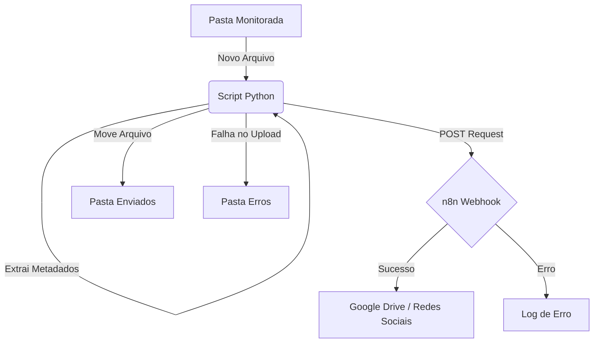

# Automação de Upload para n8n

Este projeto monitora uma pasta local em busca de novas imagens e vídeos (`.jpg`, `.png`, `.mp4`) e as envia automaticamente para um Webhook do n8n (para integração com Google Drive ou outros serviços).

O sistema suporta **agendamento de postagens** via nome do arquivo e organiza automaticamente os arquivos processados, movendo-os para uma pasta de "Enviados" em caso de sucesso ou "Erros" em caso de falha.

## 🏗️ Arquitetura



## 📋 Pré-requisitos

*   Python 3.8 ou superior
*   Gerenciador de pacotes `pip`

## 🚀 Instalação

1.  Clone este repositório ou baixe os arquivos.
2.  Instale as dependências necessárias executando o comando abaixo no terminal:

```bash
pip install requests python-dotenv watchdog pytest
```

## ⚙️ Configuração

1.  Crie um arquivo chamado `.env` na raiz do projeto.
2.  Adicione a URL do seu Webhook do n8n neste arquivo:

```env
N8N_WEBHOOK_URL=https://seu-n8n.com/webhook/caminho-do-webhook
```

## 🖥️ Como Usar (Monitoramento)

Para iniciar o monitoramento da pasta, execute o script `monitoramento.py`:

```bash
python monitoramento.py
```

*   O script criará automaticamente uma pasta chamada `pasta_monitorada` (se ela não existir).
*   **Arraste imagens** para dentro dessa pasta.
*   O upload será feito automaticamente.
*   Após o processamento, o arquivo será movido para `pasta_monitorada/Enviados` ou `pasta_monitorada/Erros`.

Para parar o monitoramento, pressione `Ctrl + C` no terminal.

## 🧪 Executando Testes

Este projeto utiliza `pytest` para garantir que a lógica de envio e tratamento de erros esteja funcionando corretamente. Para rodar os testes:

```bash
pytest test_teste.py -v
```

O parâmetro `-v` exibe os detalhes de cada teste executado.