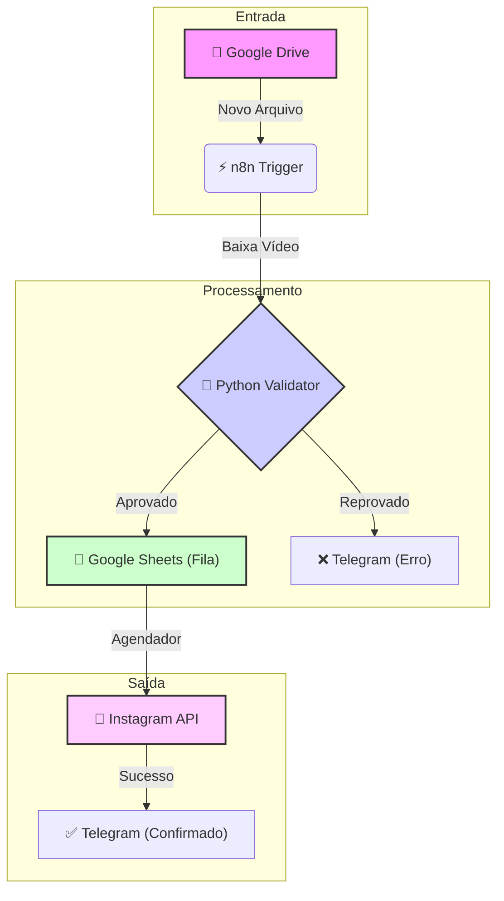

# 🚀 Automação de Vídeo via Google Drive (Drive-to-Insta)

> **Transforme o Google Drive na sua ilha de edição e o Telegram no seu painel de controle.**

Este projeto monitora pastas específicas do Google Drive, valida automaticamente vídeos para redes sociais (formato e tamanho), gerencia uma fila de agendamento inteligente via Google Sheets e notifica a equipe em tempo real pelo Telegram.

---

## 🎯 A Dor do Cliente (Visão de Produto)

Gerenciar conteúdo de vídeo para redes sociais é um pesadelo logístico que consome tempo e gera erros.
*   **O Esquecimento:** Vídeos prontos ficam "mofando" no Drive porque alguém esqueceu de agendar.
*   **O Erro Humano:** O vídeo sobe no formato errado (horizontal no Reels? 😱) ou com a legenda errada.
*   **A Falta de Feedback:** O editor não sabe se o vídeo foi aprovado, e o cliente não sabe se foi postado.

**A Solução:** Este sistema elimina o intermediário manual. O editor joga o vídeo no Drive, o sistema valida (Python), agenda (Sheets) e notifica (Telegram). Se estiver errado, o sistema avisa na hora.

---

## ⚡ Funcionalidades

### ✅ **Drive-to-Insta (Novo!)**
Monitoramento inteligente de pastas do Google Drive.
*   **Upload Automático:** Basta arrastar o arquivo de vídeo para a pasta monitorada.
*   **Validação de Formato:** Script Python verifica proporção (9:16) e tamanho (<50MB).
*   **Compressão Inteligente:** Se o vídeo for muito pesado, ele é comprimido automaticamente antes de postar.

### 🤖 **Curadoria via Telegram**
Seu "Chefe de Redação" no bolso.
*   **Notificação de Sucesso:** "Seu vídeo 'Dancinha_da_Empresa.mp4' foi validado e agendado!"
*   **Alerta de Erro:** "O vídeo 'Horizontal_Errado.mov' foi rejeitado. Motivo: Proporção incorreta (16:9). Por favor, ajuste."

### 📊 **Relatório de Sentimento (Legado)**
Análise de engajamento pós-postagem.
*   Coleta comentários e classifica como Positivo, Neutro ou Negativo usando IA.

---

## 🏗️ Arquitetura do Sistema

O fluxo de dados é unidirecional, resiliente e transparente.



---

## 🛠️ Guia de Uso Pragmático

### Passo 1: O Upload (Editor de Vídeo)
O editor finaliza o vídeo e nomeia o arquivo como ele quer que a legenda apareça (ou usa um padrão de data).
> **Exemplo:** Ele arrasta o arquivo `Promocao_Relampago_2023.mp4` para a pasta `_INPUT_INSTAGRAM` no Google Drive.

### Passo 2: O Processamento (Sistema)
O n8n detecta o arquivo em até 1 minuto.
1.  Baixa o vídeo temporariamente.
2.  Roda o script `validator.py`.
3.  O vídeo está ok (Vertical e <50MB)?
    *   **SIM:** Salva na planilha "Fila de Postagens" com status `AGUARDANDO`.
    *   **NÃO:** Para o processo e envia alerta.

### Passo 3: A Confirmação (Cliente/Social Media)
No grupo do Telegram da equipe, o Bot envia:

> **🤖 Bot de Automação:**
> "✅ Vídeo **Promocao_Relampago_2023** processado com sucesso!
> 📅 Agendado para a próxima janela livre.
> 📂 [Link para a Planilha de Controle]"

---

## 💾 Estrutura de Dados (Google Sheets)

A planilha serve como nosso "Banco de Dados de Fila". O n8n escreve, o Cron lê.

| ID (Drive) | Nome do Arquivo | Link (Drive) | Status | Data Processamento | Log de Erro |
| :--- | :--- | :--- | :--- | :--- | :--- |
| `1AbCdEfGhIjK...` | `Reels_Viral.mp4` | `drive.google.com/...` | `PENDENTE` | 2023-10-27 10:00 | - |
| `2XyZ123456...` | `Video_Ruim.mov` | `drive.google.com/...` | `ERRO_FORMATO` | 2023-10-27 10:05 | Proporção 16:9 inválida. |

### Exemplo de JSON (Payload do Webhook)

Quando o Python valida o vídeo, ele retorna este objeto JSON para o n8n:

```json
{
  "status": "sucesso",
  "data": {
    "filename": "Reels_Viral.mp4",
    "size_mb": 15.4,
    "duration_sec": 45,
    "aspect_ratio": 0.5625, // 9:16
    "is_valid": true
  },
  "message": "Vídeo aprovado para postagem."
}
```

---

## 📋 Pré-requisitos

*   Python 3.8 ou superior
*   Conta no Google Cloud Platform (para Drive e Sheets API)
*   Conta no Telegram (para criar Bot)
*   Instância do n8n (Self-hosted ou Cloud)

## 🚀 Instalação (Dev Setup)

1.  Clone este repositório.
2.  Instale as dependências do validador:
    ```bash
    pip install moviepy requests python-dotenv
    ```
3.  Configure as variáveis de ambiente no `.env`:
    ```env
    GOOGLE_DRIVE_FOLDER_ID=seu_folder_id
    TELEGRAM_BOT_TOKEN=seu_bot_token
    TELEGRAM_CHAT_ID=seu_chat_id
    ```
4.  Importe o Workflow do n8n (`workflow.json`).
5.  Execute o validador para testes locais:
    ```bash
    python validator.py
    ```

---
**Nota de Segurança:** Nunca faça commit de arquivos `.env` ou credenciais de API.
