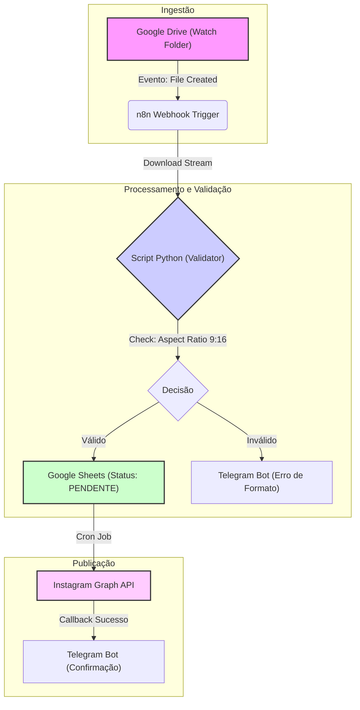

# Automação de Workflow de Mídia (Google Drive ➔ Instagram)

Este repositório contém uma solução de engenharia de software para automação do ciclo de vida de publicação de vídeos em redes sociais. O sistema integra armazenamento em nuvem (Google Drive), validação de mídia (Python) e orquestração de fluxo de trabalho (n8n), garantindo conformidade técnica e agendamento eficiente.

---

## 📋 Descrição do Projeto

O objetivo deste projeto é resolver a inconsistência e o erro humano no processo de publicação de vídeos verticais (Reels/Stories). Através de um pipeline automatizado, arquivos depositados em um diretório monitorado são validados quanto a proporção (aspect ratio), tamanho e formato antes de serem enfileirados para publicação.

A solução utiliza uma arquitetura orientada a eventos, onde o upload de um arquivo aciona uma cadeia de validação e persistência em banco de dados (Google Sheets), com notificações de status em tempo real via Webhook (Telegram).

---

## 🛠️ Stack Tecnológico

*   **Linguagem:** Python 3.8+ (Scripting e Manipulação de Vídeo)
*   **Orquestração:** n8n (Workflow Automation)
*   **Armazenamento:** Google Drive API (Trigger de Entrada)
*   **Persistência/Fila:** Google Sheets API (Controle de Estado)
*   **Manipulação de Mídia:** `moviepy`, `ffmpeg`
*   **Notificações:** Telegram Bot API
*   **Suporte a NLP:** OpenAI API (Geração opcional de legendas/hashtags)

---

## 🏗️ Arquitetura da Solução

O fluxo de dados segue um padrão unidirecional de ingestão, processamento e saída.



---

## ⚙️ Funcionalidades Principais

1.  **Ingestão Automática:** Monitoramento contínuo de diretórios específicos no Google Drive para novos arquivos de vídeo (`.mp4`, `.mov`).
2.  **Validação Técnica (Python):**
    *   Verificação de Aspect Ratio (Vertical 9:16).
    *   Verificação de Tamanho de Arquivo (< 50MB).
    *   Verificação de Codec de Vídeo/Áudio.
3.  **Compressão Condicional:** Redução automática de bitrate via `ffmpeg` caso o arquivo exceda os limites da plataforma, sem perda significativa de qualidade visual.
4.  **Gerenciamento de Fila (Buffer):** Utilização do Google Sheets como banco de dados transacional simples para controle de estado (`PENDENTE`, `PROCESSANDO`, `CONCLUÍDO`, `ERRO`).
5.  **Sistema de Notificação:** Alertas de erro técnico ou confirmação de agendamento enviados para grupo operacional no Telegram.
6.  **Geração Assistida de Texto (Opcional):** Utilização de modelos de NLP para sugerir legendas baseadas no nome do arquivo, caso configurado.

---

## 🚀 Instalação e Execução

### Pré-requisitos
*   Python 3.8+ instalado.
*   Conta de Serviço Google Cloud (com acesso às APIs Drive e Sheets).
*   Instância do n8n (Self-hosted ou Cloud).

### Passo 1: Configuração do Ambiente
Clone o repositório e instale as dependências Python:

```bash
git clone https://github.com/seu-usuario/media-workflow-automation.git
cd media-workflow-automation
pip install -r requirements.txt
```

### Passo 2: Variáveis de Ambiente
Crie um arquivo `.env` na raiz do projeto:

```env
GOOGLE_DRIVE_FOLDER_ID=seu_folder_id
GOOGLE_SHEETS_ID=seu_sheet_id
TELEGRAM_BOT_TOKEN=seu_bot_token
TELEGRAM_CHAT_ID=seu_chat_id
OPENAI_API_KEY=sua_api_key (Opcional)
```

### Passo 3: Configuração do Workflow (n8n)
1.  Importe o arquivo `workflow.json` (disponível na pasta `docs/`) para sua instância do n8n.
2.  Configure as credenciais do Google Drive e Telegram nos nós correspondentes.
3.  Ative o workflow.

### Passo 4: Execução Local (Validador)
Para testar o script de validação isoladamente:

```bash
python src/validator.py --input "caminho/para/video_teste.mp4"
```

---

## 📂 Estrutura de Dados (Fila de Processamento)

O controle de estado é mantido em uma planilha Google Sheets com a seguinte estrutura:

| ID (Drive) | Nome do Arquivo | Link (Drive) | Status | Timestamp | Log de Erro |
| :--- | :--- | :--- | :--- | :--- | :--- |
| `1AbCd...` | `campanha_reels_v1.mp4` | `drive.google.com/...` | `PENDENTE` | 2023-10-27 10:00:00 | - |
| `2XyZ1...` | `story_incorreto.mov` | `drive.google.com/...` | `ERRO_FORMATO` | 2023-10-27 10:05:00 | Aspect Ratio inválido (16:9). |

---

**Nota:** Este projeto é uma ferramenta de produtividade e deve ser configurado de acordo com as políticas de uso das plataformas integradas (Instagram/Facebook, Telegram).
